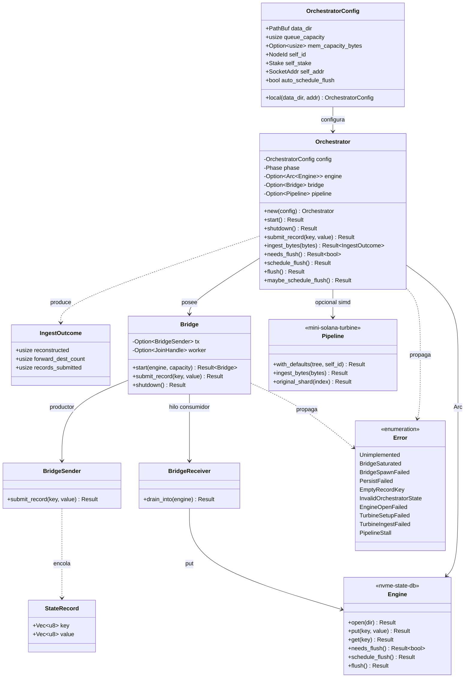

# Diagrama de clases

[English](diagrama_de_clases-EN.md) · **Español** · [Índice](README.md)

Tipos públicos principales de `solana-pipeline-unified` y su relación con los crates hermanos (solo lo que el orquestador usa).

## Notas

- `Pipeline` solo existe con feature `simd`.
- El disco (WAL/MemTable/SST) vive **dentro** de `Engine`; el orquestador no lo reimplementa.
- `make_learn_key` / `LEARN_KEY_PREFIX` (`learn/v1/`) son helpers de clave educativa, no tipos de clase.
