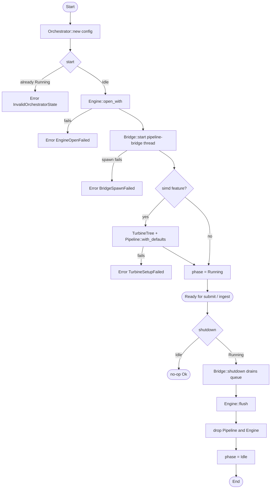
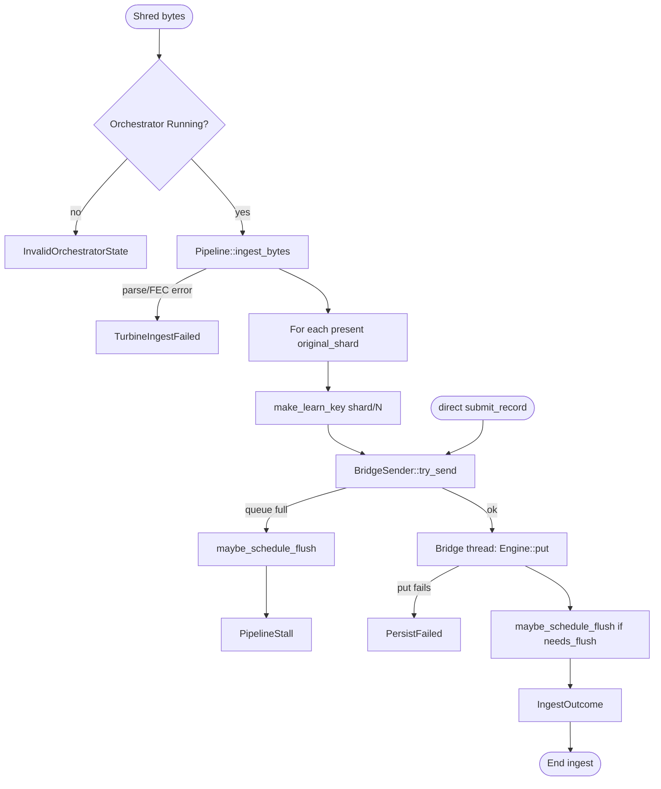
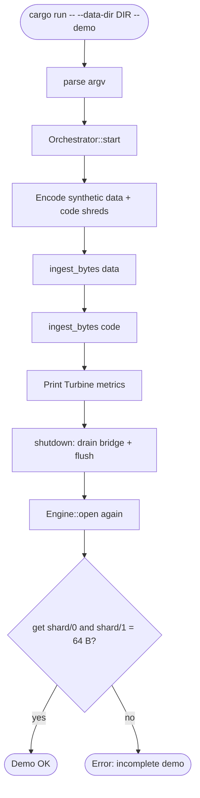
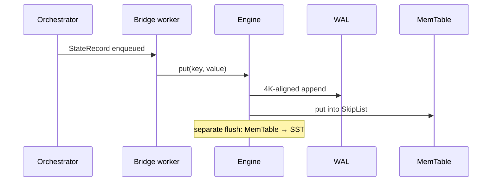

# Control flow diagram

**English** · [Español](diagrama_de_flujo-ES.md) · [Index](README.md)

The orchestrator's **control** flow: from startup to persisting shards and shutting down.

## 1. Lifecycle (`start` / `shutdown`)

## 2. Ingest → bridge → disk (`ingest_bytes` / `submit_record`)

## 3. CLI demo (`--demo`)

## Durable write order (inside nvme)

