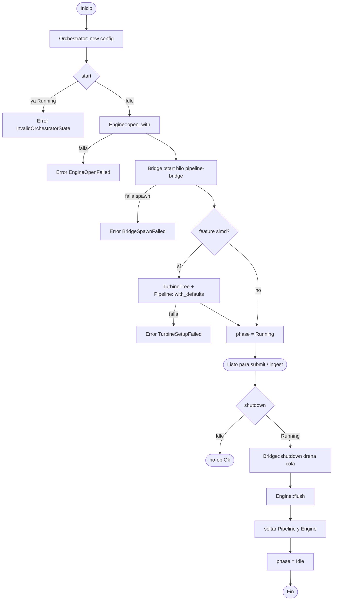
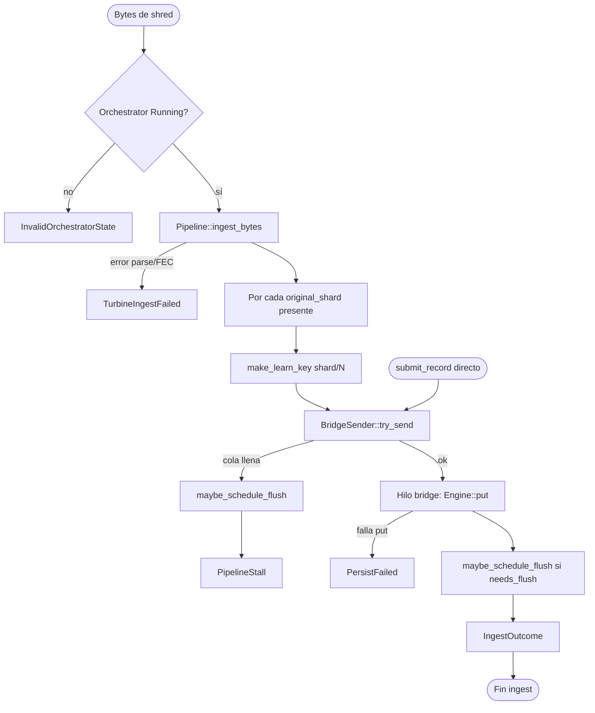
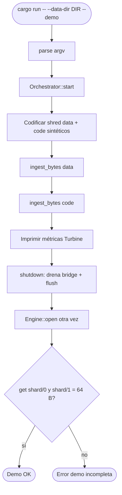
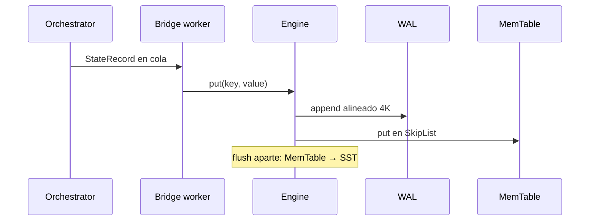

# Diagrama de flujo

Flujo de **control** del orquestador: desde el arranque hasta persistir shards y apagar.

## 1. Ciclo de vida (`start` / `shutdown`)

## 2. Ingestión → bridge → disco (`ingest_bytes` / `submit_record`)

## 3. Demo CLI (`--demo`)

## Orden durable de escritura (en nvme)

