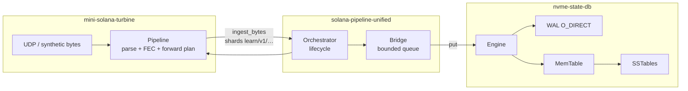
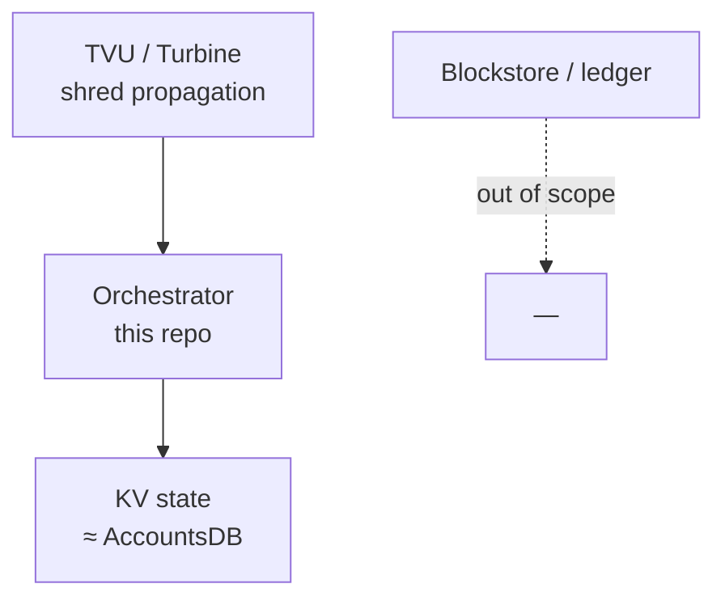

# System flowchart

**English** · [Español](flujograma-ES.md) · [Index](README.md)

**High-level** view: how the three crates of the learning stack connect.

## Quick read

| Layer | Responsibility |
| --- | --- |
| `mini-solana-turbine` | Shreds, Reed-Solomon, Turbine plan (no disk) |
| `solana-pipeline-unified` | Glue stages together: startup, queue, API calls |
| `nvme-state-db` | The **only** persistence (WAL → MemTable → SST) |

## Solana analogy (simplified)

