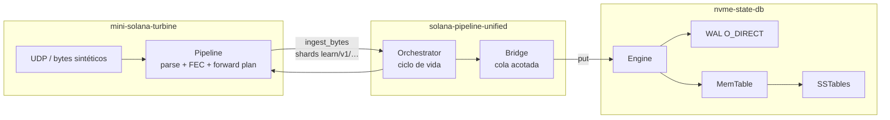
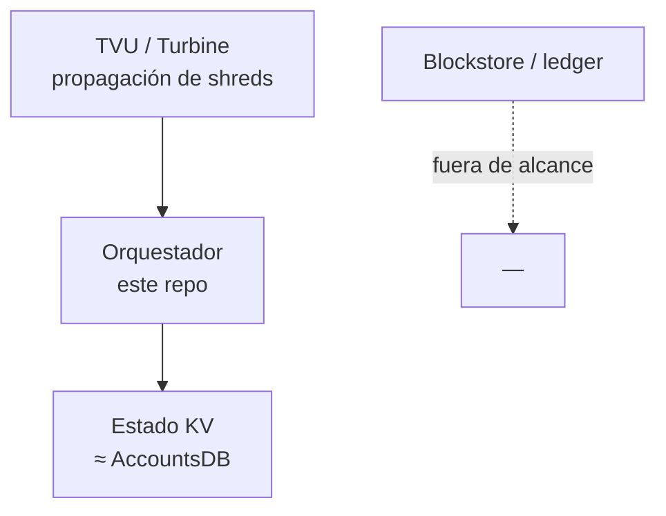

# Flujograma del sistema

[English](flujograma-EN.md) · **Español** · [Índice](README.md)

Vista de **alto nivel**: cómo se conectan los tres crates del stack de aprendizaje.

## Lectura rápida

| Capa | Responsabilidad |
| --- | --- |
| `mini-solana-turbine` | Shreds, Reed-Solomon, plan Turbine (sin disco) |
| `solana-pipeline-unified` | Pegar etapas: arranque, cola, llamadas a APIs |
| `nvme-state-db` | **Única** persistencia (WAL → MemTable → SST) |

## Analogía Solana (simplificada)

